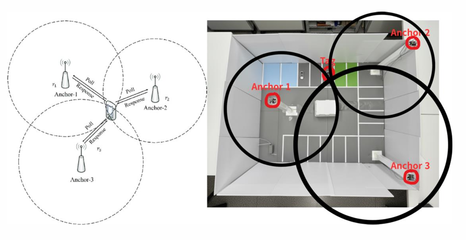
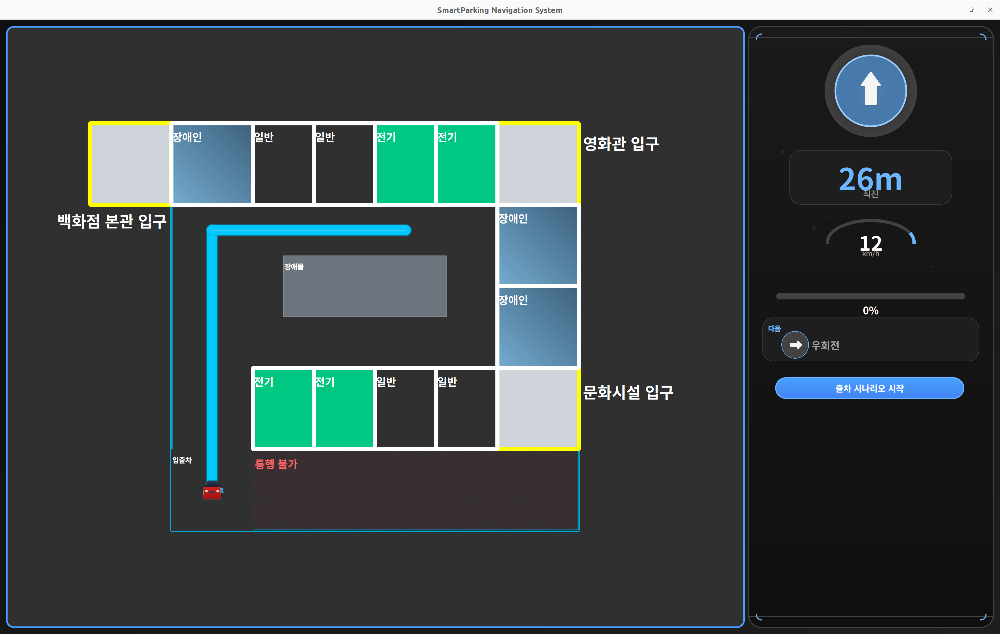
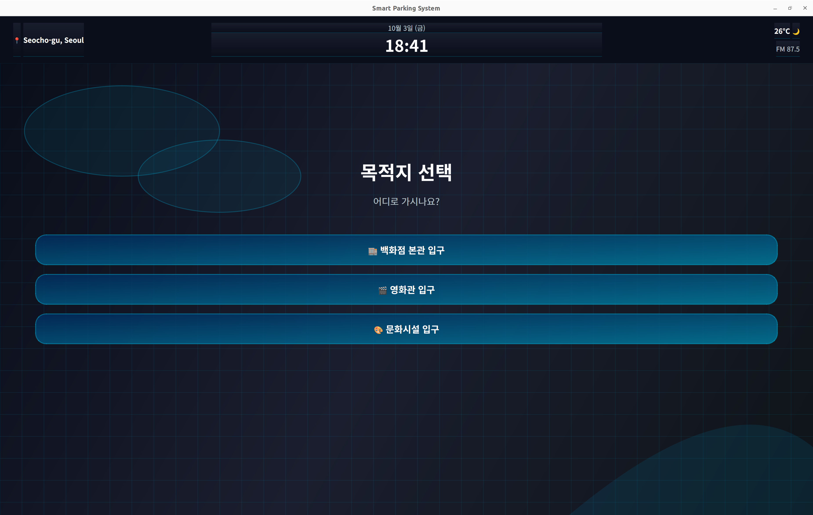
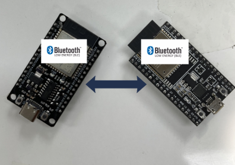
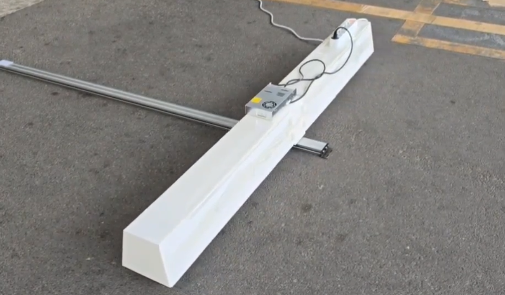
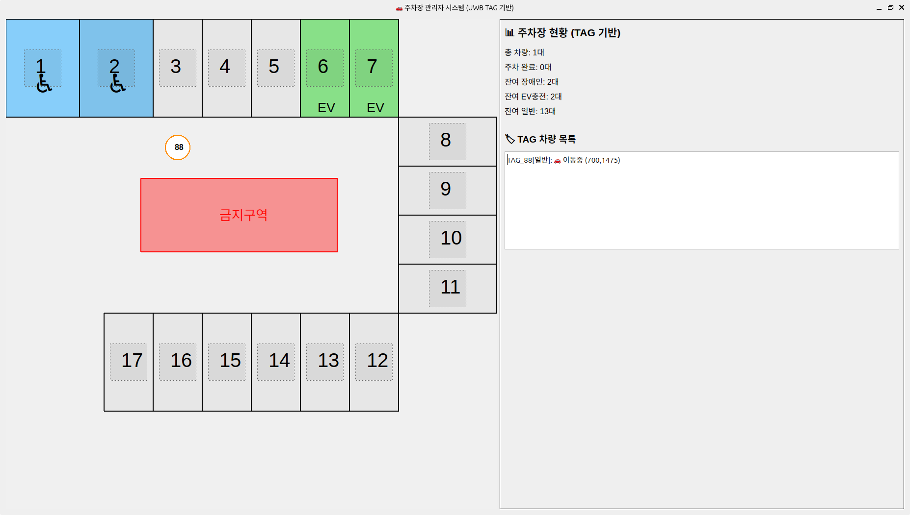
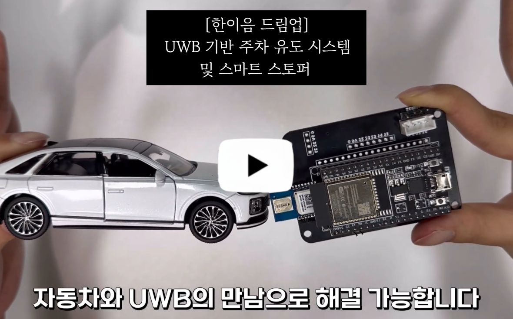

# [2025년 한이음 드림업 공모전]

## **💡1. 프로젝트 개요**

**1-1. 프로젝트 소개**
- 프로젝트 명 : UWB 기반 주차 유도 시스템 및 스마트 스토퍼
- 프로젝트 정의 : 차량의 위치를 정밀하게 추적하여 운전자에게 빈 주차공간까지 최적 경로를 안내하고, 장애인 구역 무단 진입을 차단하는 통합 주차 솔루션

  </br>

**1-2. 개발 배경 및 필요성**
- 현대 사회에서 주차 공간 부족은 운전자에게 큰 불편과 스트레스를 초래하고 있으며, 장시간의 주차 공간 탐색은 불필요한 공회전으로 이어져 환경 문제를 악화시키고 있습니다. 
- 장애인 전용 주차구역의 불법 주차는 최근 급격히 증가하여 사회적 갈등과 민원 문제로 대두되고 있습니다. 
- 이에 따라, 차량의 위치를 정밀하게 추적하고 장애인 구역 무단 점유를 사전에 차단할 수 있는 차세대 통합 주차 관리 시스템의 필요성이 커지고 있습니다.


**1-3. 프로젝트 특장점**
- UWB와 ESP32 기반 고정밀 위치 추적 (실내 주차장 환경에서도 안정적 측위 가능)
- 3단계 필터링 알고리즘 적용 (중간값 필터 → 이상치 검출 → 칼만 필터)
 
  </br>
- 스마트 스토퍼를 통한 장애인 전용 주차구역 무단 진입 차단
- 차량 유형별 맞춤형 주차 배정 서비스 (일반/장애인/전기차)
- 차량 내 HMI 안내 및 관제 대시보드 실시간 모니터링
- ROS2 기반 통합 아키텍처 (micro-ROS로 ESP32까지 연동)


**1-4. 주요 기능**

<table>
  <tr>
    <td align="center"><b>UWB 기반 위치 추적</b></td>
    <td align="center"><b>경로 안내 기능</b></td>
  </tr>
  <tr>
    <td align="center"></td>
    <td align="center"></td>
  </tr>
  <tr>
    <td align="center">태그-앵커 삼변측량 알고리즘으로 차량 위치를 센티미터 단위로 정밀 추적</td>
    <td align="center">규칙 기반 알고리즘으로 빈 주차공간까지 최적 경로 산출 후 HMI 화면 시각화</td>
  </tr>
  <tr>
    <td align="center"><b>목적지 기반 추천</b></td>
    <td align="center"><b>차량 판별 기능</b></td>
  </tr>
  <tr>
    <td align="center"></td>
    <td align="center"></td>
  </tr>
  <tr>
    <td align="center">사용자가 선택한 목적지 주변 잔여 주차공간을 차량 유형별로 자동 추천</td>
    <td align="center">BLE RSSI 신호로 차량을 자동 판별하고<br>유형(일반/전기/장애인) 분류</td>
  </tr>
  <tr>
    <td align="center"><b>스마트 스토퍼 제어</b></td>
    <td align="center"><b>실시간 관제 서비스</b></td>
  </tr>
  <tr>
    <td align="center"></td>
    <td align="center"></td>
  </tr>
  <tr>
    <td align="center">인증된 장애인 차량만 진입 허용, 일반 차량은 물리적으로 차단</td>
    <td align="center">관제 대시보드를 통해 주차장 현황과<br>차량 이동 상태를 실시간 모니터링</td>
  </tr>
</table>


**1-5. 기대 효과 및 활용 분야**
- 기대 효과 : 주차 공간 탐색 시간 단축으로 주차 효율성 향상, 장애인 전용 구역 무단 점유 방지로 이동권 보장, 주차 관리의 자동화로 운영 효율성 제고
- 활용 분야 : 대형 상업시설(백화점, 마트), 주거시설(아파트, 오피스텔), 공공기관 주차장, 스마트 시티 교통 및 주차 인프라 등 

**1-6. 기술 스택**

| 구분 | 사용 기술 |
|------|-----------|
| **UI** |  |
| **Framework** |   |
| **Languages** |    |
| **Algorithms** | `Trilateration` `Kalman Filter` `Rule-based Path Planning` `Outlier Removal` `Median Filter` `Axis Alignment` |
| **MCU** |   |
| **SBC** |  |
| **Communication** | `UWB (DWM1000)` `BLE` `Socket (TCP/IP)` `UART` `SPI` |
| **Project Management** |    |

---

## **💡2. 팀원 소개**

| **한경빈 (팀장)** | **장준표** | **장서윤** | **정재윤** | **이유진** |
|:---:|:---:|:---:|:---:|:---:|
|  |  |  |  |  |
| 🔗 [GitHub](https://github.com/hustlehan) | 🔗 [GitHub](https://github.com/IAMJP520) | 🔗 [GitHub](https://github.com/seoyun9) | 🔗 [GitHub](https://github.com/jjletsgo) | 🔗 [GitHub](https://github.com/euzin3) |
| • ROS2 노드 개발 <br> • 서버 및 관제 시스템 구축 <br> • 경로 계획 <br> &nbsp; | • 차량 HMI 인터페이스 구축 <br> • TCP/IP 기반 소켓 통신 모듈 개발 <br> &nbsp; | • micro-ROS 기반 통신 모듈 개발 <br> • BLE RSSI 기반 차량 정보 수신 <br> &nbsp; | • HW 및 시스템 아키텍처 설계 <br> • 스마트 스토퍼 제어 <br> • UWB 삼변측량 및 필터링 | • UWB 삼변측량 및 필터링 <br> &nbsp; <br> &nbsp; |
|  <br>  <br>  |  <br>  <br> &nbsp; |  <br>  <br> &nbsp; |  <br>  <br>  |  <br> &nbsp; <br> &nbsp; |


---
## **💡3. 시스템 구성도**
| **서비스 흐름도** |
|---|
| [](images\서비스%20흐름도.png) |

| **S/W 구성도** |
|---|
| [](images\SW%20구성도.png) |

| **H/W 구성도** |
|---|
| [](images\HW%20구성도.png) |

| **엔티티 관계도** |
|---|
| [](images\엔티티%20관계도.png) |

---
## **💡4. 작품 소개영상**
> <sub>이미지를 클릭하면 유튜브 시연 영상을 보실 수 있습니다.</sub> 

[](https://www.youtube.com/watch?v=wbkJ4pecB-A)

---
## **💡5. 핵심 소스코드**

- **삼변측량 (Trilateration 알고리즘)**  
UWB 태그와 앵커 사이의 거리 정보를 이용하여 차량의 2차원 좌표(x, y)를 계산하는 핵심 알고리즘입니다.  
3개의 앵커 좌표(`a[3]`)와 각각의 거리값(`r[3]`)을 입력받아, 선형방정식을 풀어 차량의 위치를 산출합니다.  
det(행렬식)이 0에 가까우면 해가 존재하지 않으므로 예외 처리를 수행합니다. 
  

```C
static bool trilat2D(const Vec3 a[3], const float r[3], float &x, float &y) {
    // 앵커 간 좌표 차이를 기반으로 행렬 A 구성
    float A11 = 2.0f*(a[1].x - a[0].x), A12 = 2.0f*(a[1].y - a[0].y);
    float A21 = 2.0f*(a[2].x - a[0].x), A22 = 2.0f*(a[2].y - a[0].y);

    // 각 앵커와 태그 사이의 거리 제곱과 좌표를 이용한 b 벡터 계산
    float b1  = (r[0]*r[0] - r[1]*r[1])
              + (a[1].x*a[1].x - a[0].x*a[0].x)
              + (a[1].y*a[1].y - a[0].y*a[0].y);
    float b2  = (r[0]*r[0] - r[2]*r[2])
              + (a[2].x*a[2].x - a[0].x*a[0].x)
              + (a[2].y*a[2].y - a[0].y*a[0].y);

    // 행렬식(det)이 0에 가까우면 연립방정식을 풀 수 없음
    float det = A11*A22 - A12*A21;
    if (fabsf(det) < 1e-6f) return false;

    // Cramer’s rule을 통해 (x, y) 좌표 계산
    x = ( b1*A22 - A12*b2) / det;
    y = (-b1*A21 + A11*b2) / det;
    return true;
}
```

- **BFS 기반 주차공간 배정 알고리즘**  
BFS 기반 탐색 로직을 활용해 차량의 유형(장애인/전기차/일반차)과 목적지(입구 위치)를 고려하여
가장 가까운 주차 공간을 자동으로 배정하는 알고리즘입니다.

```python
def assign_parking_spot_with_bfs(self, preferred: str, elec: bool, disabled: bool, destination: int) -> Optional[int]:
    """destination 기반 BFS 주차공간 배정 로직"""

    # 이미 점유된 공간 수집
    occupied_spots = {v.parked_spot for v in self.vehicles.values() if v.is_parked and v.parked_spot}

    # 차량 유형별 주차구역 정의
    disabled_spots, elec_spots, general_spots = [1,6,7], [4,5,10,11], [2,3,8,9]

    # 사용 가능한 주차구역(점유되지 않은 것만)
    available_disabled = [s for s in disabled_spots if s not in occupied_spots]
    available_elec = [s for s in elec_spots if s not in occupied_spots]
    available_general = [s for s in general_spots if s not in occupied_spots]

    # 현재 사용 가능한 공간 로깅
    self.get_logger().info(f'사용 가능 - 장애인:{len(available_disabled)} 전기차:{len(available_elec)} 일반:{len(available_general)}')

    # 입구 좌표 (0: 본관, 1: 별관, 2: 주차타워)
    entrance_coords = {0:(0,1800), 1:(1800,1800), 2:(1800,600)}

    # 유효하지 않은 destination 입력 시 기본값(본관) 적용
    if destination not in entrance_coords:
        destination = 0
        self.get_logger().warn('잘못된 destination 값 → 기본값(0: 본관) 적용')

    entrance_x, entrance_y = entrance_coords[destination]

    # BFS 우선순위 탐색을 위한 거리 기준 정렬
    sorted_disabled = self._sort_spots_by_distance(available_disabled, entrance_x, entrance_y)
    sorted_elec = self._sort_spots_by_distance(available_elec, entrance_x, entrance_y)
    sorted_general = self._sort_spots_by_distance(available_general, entrance_x, entrance_y)
```